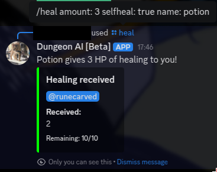
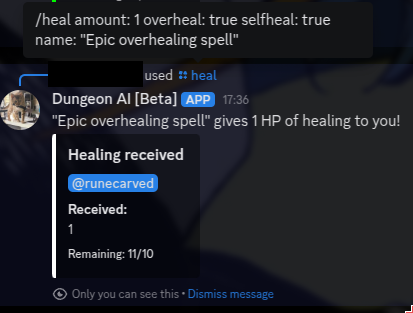
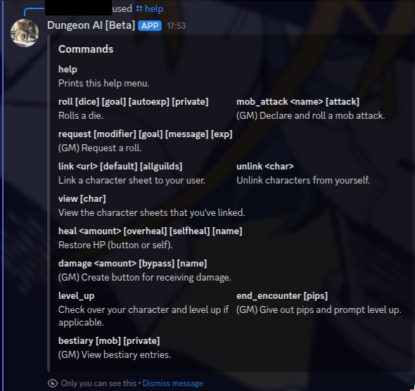

.. Dungeon AI documentation master file, created by
   sphinx-quickstart on Mon Jun 17 21:53:44 2024.
   You can adapt this file completely to your liking, but it should at least
   contain the root `toctree` directive.

   ######################################
   Welcome to Dungeon AI's documentation!
   ######################################

..
   .. autosummary::
      :toctree: _autosummary
      :template: custom-module-template.rst
      :recursive:
      
      commands

..
   .. toctree::
      :maxdepth: 2
      :caption: Contents:

   .. Indices and tables
   .. ==================

   .. * :ref:`genindex`
   .. * :ref:`modindex`
   .. * :ref:`search`

General Commands
================

Below are DungeonAI's general-use commands (for both players and GMs). The bot relies on slash commands; this means, for example, that you can run help() by typing "/help".

..
   _heal:

   heal
   ****

.. py:function:: heal(amount,overheal=False,selfheal=False,name="")

  **/heal** - Applies healing.

  :param amount: Amount of damage to heal. (Required)
  :type amount: int

  :param overheal: Whether or not the healing should be able to give the target additional HP beyond their typical maximum. (Default: False)
  :type overheal: bool

  :param selfheal: Whether or not to automatically apply healing to self. If false, it will generate a button that can be clicked by anyone instead. Default: False.
  :type selfheal: bool

  :param name: The name of the entity or ability providing healing.
  :type name: str

  :return: A button (if selfhealing not requested) for healing and reports of all healing applied.

.. 
   _help:

   help
   ****

.. py:function:: help()
   
   **/help** - Lists available commands.

   :return:
      | """
      | **help:** Prints this help menu.
      | **roll [dice] [goal] [autoexp] [private]:** Rolls a die.
      | **link <url> [default] [allguilds]:** Link a character sheet to your user.
      | **unlink <char>:** Unlink characters from yourself.
      | **view [char]:** View the character sheets that you've linked.
      | **heal <amount> [overheal] [selfheal] [name]:** Restore HP (button or self).
      | **damage <amount> [bypass] [name]:** (GM) Create button for receiving damage.
      | **mob_attack <name> [attack]:** (GM) Declare a mob attack.
      | **mob_attack <name> [attack]:** (GM) Request a roll.
      | **end_encounter [pips]:** (GM) Give out pips and prompt level up.
      | **bestiary [mob] [private]:** (GM) View bestiary entries.
      | """

   
.. 
   _roll:

   roll
   ****

.. py:function:: roll(modifier='',goal=None,private=False)

   **/roll** - Default: rolls 1d20 with no modifier. Rolls 1d20 with the provided modifier.

   :param modifier: String representing the dice modifier to be rolled, in format `skillname+statname+X` or `-X`. (Default: 0).
    Calls your default character if non-numeric values are provided.
   :type dice: str

   :param goal: Value to meet or exceed when rolling. Reports back success/failure if given. (Optional)
   :type goal: int

   :param autoexp: Automatically gain exp for attempting the roll, if applicable. (Default: False)
   :type autoexp: bool

   :param private: Hide your roll and result from other users. (Default: False)
   :type private: bool

   :return: Message indicating the rolled value and, if a goal was provided, whether it was a success or failure.

..image::roll_auto.png

..image::roll_manual.png

Player Commands
===============

Below are additional commands intended for player use.

..
  _levelup:

  levelup
  *******

.. py:function:: levelup()
   
  **/levelup** - Scans for current exp on your current default character sheet and rank/level up as appropriate.

  :return: A levelup report with stat adjustment buttons, if applicable.

..image::levelup.png

.. 
   _link:

   link
   ****

.. py:function:: link(url,default=True,allguilds=False)

   **/link** - Links a character sheet to your user on this server. If already linked, modifies link settings.

   :param url: The URL or token of your character sheet. (Required)
   :type url: str
   :param default: Set the character sheet as your default character sheet for the current server. (Default: True)
   :type default: bool
   :param allguilds: Make this character sheet accessible from all Discord servers you are in (Default: False)
   :type allguilds: bool
   :return: Message indicating the character ID, guild association status, and default status.

.. 
   _unlink:

   unlink
   ******

.. py:function:: unlink(char)

   **/unlink** - Unlink one or more characters from yourself.

   :param char: 'all', 'guild', a character ID, or a comma-separated list of IDs. (Required)
   :type char: str
   :return: Message indicating successfully removed data and data that was requested to be moved but was not present.

.. 
   _view:

   view
   ****

.. py:function:: view(char='guild',private=True)

   **/view** - View a list of your characters.

   :param char: 'all', 'guild', ID,  or comma-separated list of IDs of characters you wish to view. (Default: guild)
   :type char: str
   :param private: Hide the message from other users in this server. (Default: True)
   :type private: bool
   :return: A table of the requested character IDs and their associations.

..image::view.png

GM Commands
===========

Below are additional commands intended for GM use.

..
  _bestiary:

  bestiary
  ********

.. py:function:: bestiary(mob="",private=True)

   **/bestiary** - View a bestiary page or table of contents.

   :param mob: The creature you want to see the stats for. If unspecified, returns a list of available creatures. (Optional)
   :type mob: str

   :param private: Whether or not the resulting message should be hidden from other users. (Default: True)
   :type private: bool

   :return: Bestiary information.

..
   _damage:

   damage
   ******

.. py:function:: damage(amount,bypass=False,name="")

   **/damage** - Create a button for dealing damage.

   :param amount: Amount of damage the button deals. (Required)
   :type amount: int

   :param bypass: Whether or not the damage ignores DR. (Default: False)
   :type bypass: bool 

   :param name: Name of the entity or ability dealing damage. (Optional)
   :type name: str

   :return: A button that, when clicked, assigns damage to the character of the player who clicked it.

.. image::damage_normal.png
.. image::damage_bypass.png

..
  _end_encounter

  end_encounter
  *************

.. py:function:: end_encounter(pips=0)

   **/end_encounter** - Ends the current encounter, giving players the opportunity to claim pips and level up.

   :param pips: How many pips to give out. (Default: 0)
   :type pips: int

   :return: A button to claim pips and reminder to check for levelup.

..image::pips

..
  _mob_attack

  mob_attack
  **********

.. py:function:: mob_attack(mob,attack=""):

   **/mob_attack** - Declares a mob attack, allowing players to respond.

   :param mob: Name of the mob you want to attack with. (Required)
   :type mob: str

   :param attack: Number (1-3) or name of the attack you want to use. If blank, uses the first attack in the creature's attack list. (Optional)
   :type attack: str
   
   :return: Respond/Pass buttons for players and Roll button for GM.

..image::mob_attack.png

..
  _request

  request
  *******

.. py:function:: request(modifier,goal,message="",exp=True)

   **/request** - Requests the specified roll from players.

   :param modifier: A modifier, following the `/roll` syntax, for the roll. (Required)
   :type modifier: str

   :param goal: The value to meet or exceed when rolling. This is not relayed in the resulting messsage. (Required)
   :type goal: int

   :param message: The message for the roll, to help players know what the roll is for. (Optional)
   :type message: str

   :param exp: Whether or not to automatically grant exp for attempting the roll, if applicable. (Default: True)
   :type param: True

   :return: A button that rolls as specified.

..image::request_noskill.png
